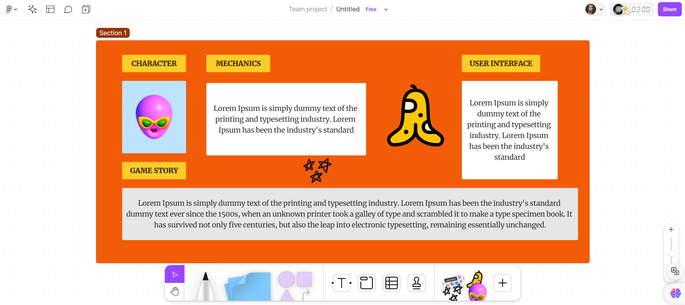

    <h1>TEAM LOGO:</h1>

    <b>SCRUM MASTER:</b>
    ZOZAN AKDOĞAN

    <b>PRODUCT OWNER:</b>
    YAĞIZ ŞAHİNLER

        <b>DEVELOPER:</b>
        YASİN BEKEN

    <b>DEVELOPER:</b>
    ZÜMRA BETÜL ALKAN

    <b>DEVELOPER:</b>
    ZEYNEP SUDE DUMAN

    <h1>GAME LOGO:</h1>

    <b>TEAM NAME:</b>
    EPIC MIND

    <b>GAME NAME:</b>
    SOUL HARMONIZER

    <b>PRODUCT BACKLOGS:</b>
    <h4>TRELLO LINK:</h4>
    
  <a href="https://trello.com/invite/b/xrTqoIbq/ATTI4f8740de48680f66f6c977fad6bb6cdd8AB256ED/epic-minds">
    <strong>EPIC MIND'S TRELLO</strong>
  </a>

    <h3>PRODUCT DESCRIPTION:</h3>
    
Soul Harmonizer is a 3D platformer and puzzle experience that is shaped by the power of emotions. At the center of the game are the character's abilities, which change according to the emotions they feel, and how they interact in the game world. The game has a specific storyline and offers rich content that will challenge players both mentally and emotionally throughout the various levels.

    <h3>GAME DESCRIPTION:</h3>
    
Soul Harmonizer is a 3D action-adventure game full of emotional exploration that takes players on the adventure of an amnesiac main character. The game begins with the main character opening his eyes in a forest. The character reinvents himself and improves his abilities through the various emotions he discovers over time.

    
    
<b>Emotional Explorations and Skill Development:</b> 
    The main character explores emotions such as anger, compassion, and fear. For example, he strengthens his combat abilities by controlling his anger, or uses his compassion to gain forest animals as pets.

    
<b>Nature and Forest Themed Locations:</b> 
    Players adventure in a world filled with vast and detailed forests to explore. A dynamic environment is presented; Day and night cycles add depth to the game.

    
<b>Enhanced Storytelling:</b> 
    The game offers an in-depth story that tells the character's journey to recall his past and memory. As we watch the main character grow emotionally and mentally, players go on an emotional journey with him.

    
<b>Strategic Combat and Puzzle Solving:</b> 
    In addition to improving combat abilities, the game also encourages puzzle solving and strategic thinking. It offers a dynamic combat system where each emotion is integrated with a different usage style and game mechanics.

    <h3>GAME FEATURES:</h3>
    <h4>FEAR:</h4>
    

        <b>Effect Mechanics:</b>
    When encountering wild animals in the forest or in dark environments, the fear bar appears and increases over time.
    

    

        <b>Result:</b>
    As the fear level increases, the character's reaction slows down and certain abilities are affected.
    

    <h4>ANGER:</h4>
    
<b>Effect Mechanics:</b>
    Increases enemy damage by 50% for 15 seconds.

    
<b>Results:</b>
    As the fear level increases, the character's reaction slows down and certain abilities are affected.

    <h4>COMPASION AND DEVOTION:</h4>
    
<b>Effect Mechanics:</b>
    Can form an alliance with an encountered NPC or tame animals in the forest by feeding them.

    
 <b>Conclusion:</b>
    Tamed animals can help the character or offer special abilities.

    <h4>SADNESS:</h4>
    
<b>Effect Mechanics:</b>
     When an ally or pet is lost, the character takes -10 damage.

    
 <b>Results:</b>
    After each experience of sadness, the effect diminishes and the character gains resilience and becomes less susceptible to future losses.

    <h4>BRAVERY:</h4>
    
<b>Effect Mechanics:</b>
     As the combats are won, the ability to control the emotion of fear increases and the fear bar begins to fill more slowly.

    
 <b>Results:</b>
    Courage reduces the character's fear level and makes him less affected by making him more successful in battles.
These emotions and abilities increase the depth of the game, make the player feel the emotional and mental development of the character, and emphasize the importance of in-game decisions and strategies.

   

    <h3>PRODUCT DESCRIPTION:</h3>
    
Soul Harmonizer is a 3D platformer and puzzle experience that is shaped by the power of emotions. At the center of the game are the character's abilities, which change according to the emotions they feel, and how they interact in the game world. The game has a specific storyline and offers rich content that will challenge players both mentally and emotionally throughout the various levels.

    <h3>TARGET GROUP:</h3>
    
+8 years and above

    
Action, Adventure and puzzle lovers.

   

      
      
      
      
   

<h1 align="center"><i> Sprint 1 </i></h1>

## Sprint Scoring
We scored to evaluate the sprints and evaluated the scoring of our first sprint as 7 points.
As a team, we closed our first sprint with 7 full points because every topic we discussed for the first sprint was addressed.

## Daily Meetings
We strive to be a team that is in contact at all times so that communication is continuous and everyone has equal information about the product.
**Time:** Every day between 9-10 am
**Place:** Discord Voice Channel- WhatsApp

   

      
      
      
      
   

### Development Process
Since each team member will take part in every step of product development and other steps, we did not need to separate them into teams.

- **Process of Determining Character Game Name and Team Names**
- We decided to go through a process that is democratic and supports voting integrity.

   

      
      
      
      
      
      
   

- Problems and obstacles encountered

- Due to the low motivation of the team at the beginning due to meeting and other stressful factors (final period, holidays, etc.), there was a general period of communication and indecision within the team. At this point, sincerely expressing expectations and sensitivities moved the team to a place where they trust and support each other.

### Notes and Additional Information

- All tasks and progress will be tracked on the [Trello](https://trello.com/invite/b/xrTqoIbq/ATTI4f8740de48680f66f6c977fad6bb6cdd8AB256ED/epic-minds)
- Each sprint will be uploaded at least one day before the sprint date and we will have a wider time frame to talk about it.
  
# Sprint Review 

## Participants

Yağız, Yasin, Zeynep, Zümra, Zozan

## Meeting Agenda
First sprint and game draft

1. **Sprint Goals**
   - Completing character selection
   - Writing basic movement codes
   - The game content was discussed and the game story and general content were decided.

2. **Collecting Feedback**
   - Self-evaluations of team members
   - What can be done to make up for the past three weeks?

3. **Deficiencies and Areas for Improvement**
   - Using icebreaker content for team motivation
   - Specification of areas that need to be worked on in the next sprint

# Sprint Retrospective

- **Good Parts:**
  - Increased communication and trust between team members
  - Sprint goals were largely completed successfully.
  - Daily stand-up meetings were productive and problems were resolved quickly.
  - Making assignments to the right members is an indication that the process will accelerate and progress better.
  - The positive aspects of collaboration and communication within the team were very beneficial to the content.

- **Bad Parts:**
  - The slow progress of the process until a certain date.
  - Small deadlines are exceeded, even if only slightly.

- **They will be improved:**
  - Duty periods need to be planned more realistically.
  
**Targets for the Next Sprint:**
- The development of the character in the game was discussed.
- The date has been set for level design, UI and AI add-ons.
