

    <h1>TEAM LOGO:</h1>

    <b>SCRUM MASTER:</b>
    ZOZAN AKDOĞAN

    <b>PRODUCT OWNER:</b>
    YAĞIZ ŞAHİNLER

        <b>DEVELOPER:</b>
        YASİN BEKEN

    <b>DEVELOPER:</b>
    ZÜMRA BETÜL ALKAN

    <b>DEVELOPER:</b>
    ZEYNEP SUDE DUMAN

    <h1>GAME LOGO:</h1>

    <b>TEAM NAME:</b>
    EPIC MIND

    <b>GAME NAME:</b>
    SOUL HARMONIZER

    <b>PRODUCT BACKLOGS:</b>
    <h4>TRELLO LINK:</h4>
    
  <a href="https://trello.com/invite/b/xrTqoIbq/ATTI4f8740de48680f66f6c977fad6bb6cdd8AB256ED/epic-minds">
    <strong>EPIC MIND'S TRELLO</strong>
  </a>

    <h3>PRODUCT DESCRIPTION:</h3>
    
Soul Harmonizer is a 3D platformer and puzzle experience that is shaped by the power of emotions. At the center of the game are the character's abilities, which change according to the emotions they feel, and how they interact in the game world. The game has a specific storyline and offers rich content that will challenge players both mentally and emotionally throughout the various levels.

    <h3>GAME DESCRIPTION:</h3>
    
Soul Harmonizer is a 3D action-adventure game full of emotional exploration that takes players on the adventure of an amnesiac main character. The game begins with the main character opening his eyes in a forest. The character reinvents himself and improves his abilities through the various emotions he discovers over time.

    
    
<b>Emotional Explorations and Skill Development:</b> 
    The main character explores emotions such as anger, compassion, and fear. For example, he strengthens his combat abilities by controlling his anger, or uses his compassion to gain forest animals as pets.

    
<b>Nature and Forest Themed Locations:</b> 
    Players adventure in a world filled with vast and detailed forests to explore. A dynamic environment is presented; Day and night cycles add depth to the game.

    
<b>Enhanced Storytelling:</b> 
    The game offers an in-depth story that tells the character's journey to recall his past and memory. As we watch the main character grow emotionally and mentally, players go on an emotional journey with him.

    
<b>Strategic Combat and Puzzle Solving:</b> 
    In addition to improving combat abilities, the game also encourages puzzle solving and strategic thinking. It offers a dynamic combat system where each emotion is integrated with a different usage style and game mechanics.

    <h3>GAME FEATURES:</h3>
    <h4>FEAR:</h4>
    

        <b>Effect Mechanics:</b>
    When encountering wild animals in the forest or in dark environments, the fear bar appears and increases over time.
    

    

        <b>Result:</b>
    As the fear level increases, the character's reaction slows down and certain abilities are affected.
    

    <h4>ANGER:</h4>
    
<b>Effect Mechanics:</b>
    Increases enemy damage by 50% for 15 seconds.

    
<b>Results:</b>
    As the fear level increases, the character's reaction slows down and certain abilities are affected.

    <h4>COMPASION AND DEVOTION:</h4>
    
<b>Effect Mechanics:</b>
    Can form an alliance with an encountered NPC or tame animals in the forest by feeding them.

    
 <b>Conclusion:</b>
    Tamed animals can help the character or offer special abilities.

    <h4>SADNESS:</h4>
    
<b>Effect Mechanics:</b>
     When an ally or pet is lost, the character takes -10 damage.

    
 <b>Results:</b>
    After each experience of sadness, the effect diminishes and the character gains resilience and becomes less susceptible to future losses.

    <h4>BRAVERY:</h4>
    
<b>Effect Mechanics:</b>
     As the combats are won, the ability to control the emotion of fear increases and the fear bar begins to fill more slowly.

    
 <b>Results:</b>
    Courage reduces the character's fear level and makes him less affected by making him more successful in battles.
These emotions and abilities increase the depth of the game, make the player feel the emotional and mental development of the character, and emphasize the importance of in-game decisions and strategies.

   

    <h3>PRODUCT DESCRIPTION:</h3>
    
Soul Harmonizer is a 3D platformer and puzzle experience that is shaped by the power of emotions. At the center of the game are the character's abilities, which change according to the emotions they feel, and how they interact in the game world. The game has a specific storyline and offers rich content that will challenge players both mentally and emotionally throughout the various levels.

    <h3>TARGET GROUP:</h3>
    
+8 years and above

    
Action, Adventure and puzzle lovers.

   

      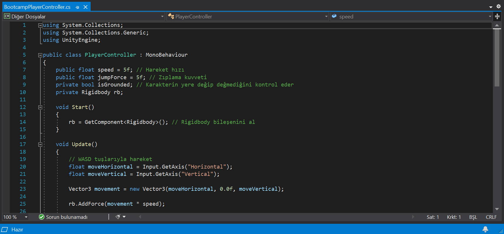
      
      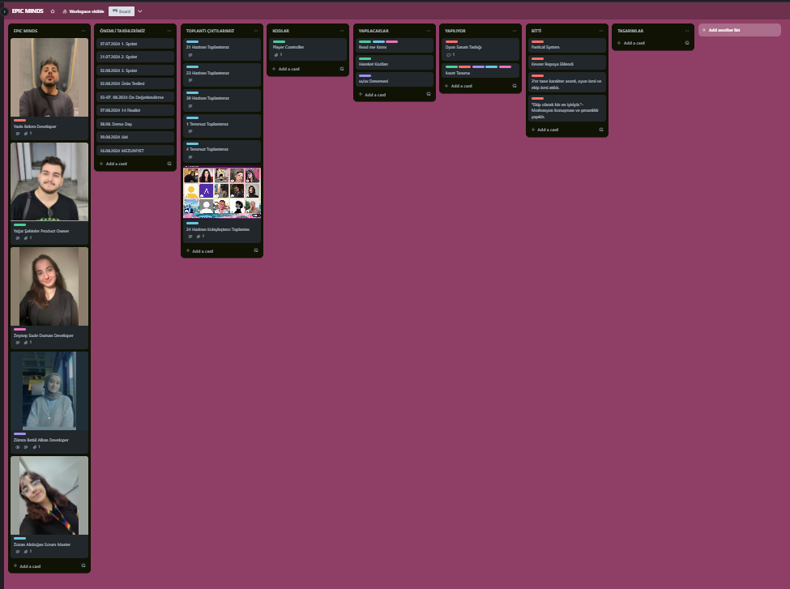
      
      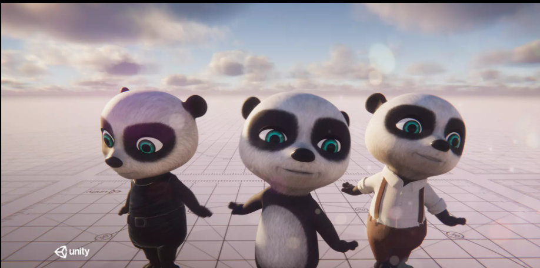
   

<h1 align="center"><i> Sprint 1 </i></h1>

## Sprint puanlaması
Sprintlerin değerlendirilmesi için puanlama yaptık ve ilk sprintimizin puanlamasını 7 puan olarak değerlendirdik.
Takım olarak ilk sprint için görüştüğümüz her başlık ele alındığı için 7 tam puanla ilk sprintimizi kapattık.

## Günlük Toplantıları 
İletişimin sürekli olması ve ürüne dair herkesin bilgi eşitliğine sahip olması için her an temasta olan bir ekip olmak için çabalıyoruz.
**Zaman:** Her gün saat  9-10 arası
**Yer:** Discord Ses Kanalı- WhatsApp  

   

      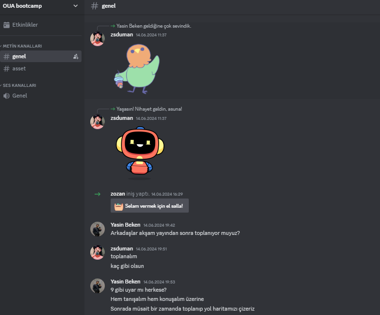
      
      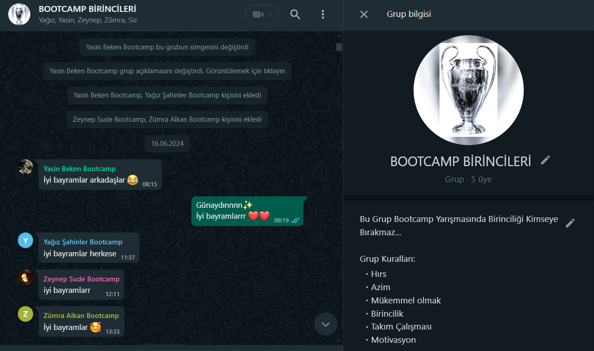
      
      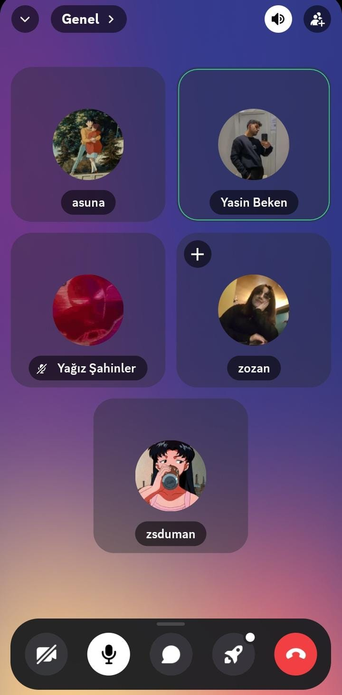
      
   

### Geliştirme Süreci 
Her takım üyesi ürün geliştirmenin ve diğer adımların her basamağında rol alacağı için ekiplere ayırma ihtiyacı duymadık.

- **Karakter Oyun İsmi ve Ekip isimlerinin belirlenme Süreci**
- Demokratik ve oy bütünlüğünü destekleyen bir süreç geçirmeye karar verdik.

   

      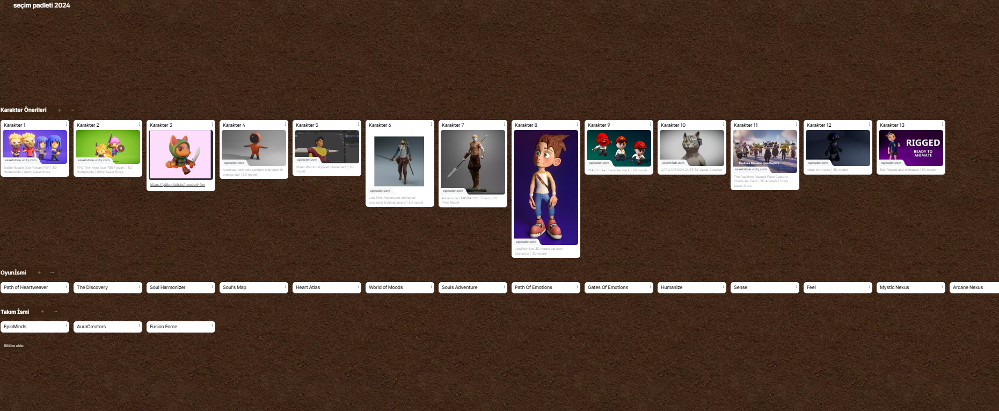
      
      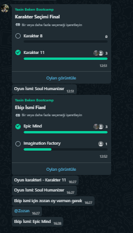
      
      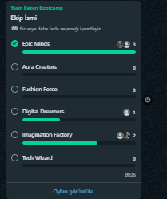
      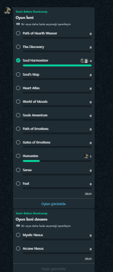
      
      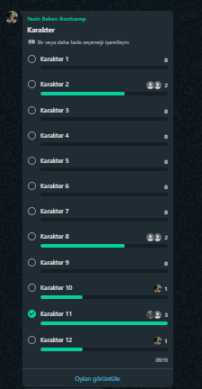
   

- Karşılaşılan sorunlar ve engeller

- Ekip motivasyonun başlangıçta tanışma ve diğer stresli etmenlerden( final dönemi, bayram vs) kaynaklı düşük olmasından ötürü ekip içerisinde genel bir iletişim ve kararsızlık süreci yaşandı bu noktada samimiyetle beklentiler ve hassasiyetlerin dile getirilmesi ekibi birbirine güvenen ve destekleyen bir yere taşıdı.

### Notlar ve Ek Bilgiler

- Tüm görevler ve ilerlemeler [Trello panosunda](https://trello.com/invite/b/xrTqoIbq/ATTI4f8740de48680f66f6c977fad6bb6cdd8AB256ED/epic-minds) takip edilecektir.
- Her sprint sprint tarihinden en az bir gün önce yüklenecek ve üzerine konuşmamız için daha geniş bir zaman dilimimiz olacaktır.
- 
# Sprint Review 

## Katılımcılar
Yağız, Yasin, Zeynep, Zümra, Zozan
## Toplantı Gündemi
İlk sprint ve oyun taslağı

1. **Sprint Hedefleri**
   - Karakter seçiminin tamamlanması
   - Temel hareket kodlarının yazılması
   - Oyun içeriği üzerine konuşuldu oyun hikayesi ve genel içerik kararlaştırıldı.

2. **Geri Bildirimlerin Toplanması**
   - Takım üyelerinin kendi iç değerlendirmeleri
   - Geçen üç haftanın telafisi için neler yapılabilir

3. **Eksiklikler ve İyileştirme Alanları**
   - ekip motivasyonu için icebreaker içeriklerin kullanılması
   - Gelecek sprintte üzerinde çalışılması gereken alanların spesifikleştirilmesi

# Sprint Retrospective

- **İyi Gidenler:**
  - Takım üyeleri arasındaki iletişimin ve güvenin artması 
  - Sprint hedefleri büyük ölçüde başarıyla tamamlandı.
  - Günlük stand-up toplantıları verimli geçti ve sorunlar hızlıca çözüldü.
  -  Görevlendirmelerin doğru üyelere yapılması sürecin hızlanmasını ve daha iyi ilerleyeceğinin göstergesi
  -  Takım içindeki işbirliği ve iletişimin olumlu yönlerinin içeriğe yararı oldukça fazlaydı

- **İyi Gitmeyenler:**
  - Sürecin belli bir tarihe kadar yavaş ilerlemesi.
  - - Verilen ufak deadlinelerın ufak da olsa sarkması

- **İyileştirilebilirler:**
  - Görev sürelerinin daha gerçekçi planlanması gerekiyor.
  
**Sonraki Sprint İçin Hedeflenenler:**
- Oyun içerisindeki karakterin geliştirilmesi konuşuldu.
- Level design, uı ve ai eklentileri için tarih belirlendi.
