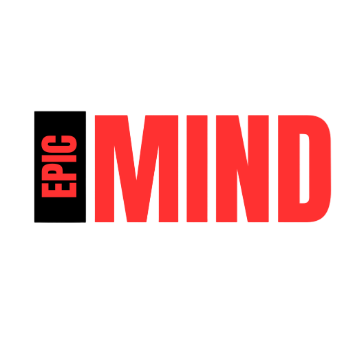
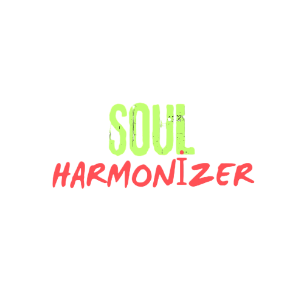

    <b>SCRUM MASTER:</b>
    ZOZAN AKDOĞAN

    <b>PRODUCT OWNER:</b>
    YAĞIZ ŞAHİNLER

        <b>DEVELOPER:</b>
        YASİN BEKEN

    <b>DEVELOPER:</b>
    ZÜMRA BETÜL ALKAN

    <b>DEVELOPER:</b>
    ZEYNEP SUDE DUMAN

    <h1>GAME LOGO:</h1>

## Takım İsmi
Epic Minds

## Oyun İsmi 
SOUL HARMONİZER

## Product Backlogs
Trello Linki
https://trello.com/invite/b/xrTqoIbq/ATTI4f8740de48680f66f6c977fad6bb6cdd8AB256ED/epic-minds

## Oyun Açıklaması
Projeyi kullanmak için aşağıdaki komutları çalıştırabilirsiniz:

## Oyun Özellikleri
1
2
3
## Hedef Kitle

<h1 align="center"><i> Sprint 1 </i></h1>
