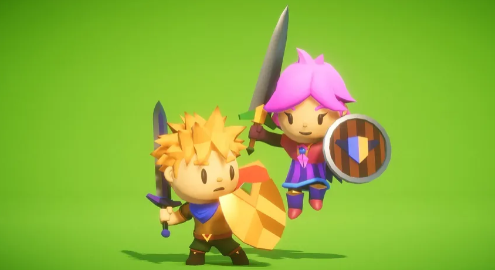
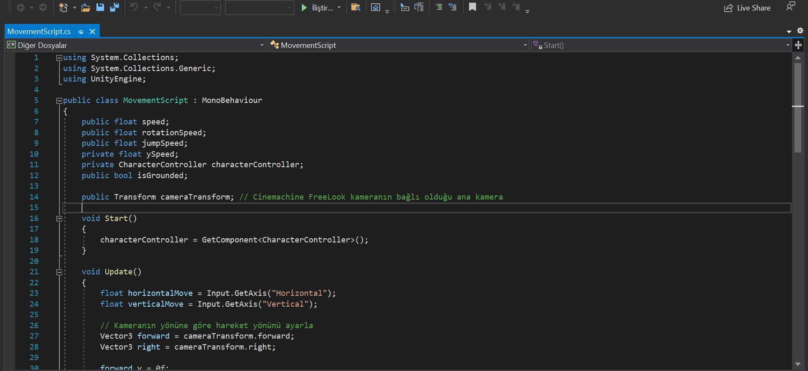
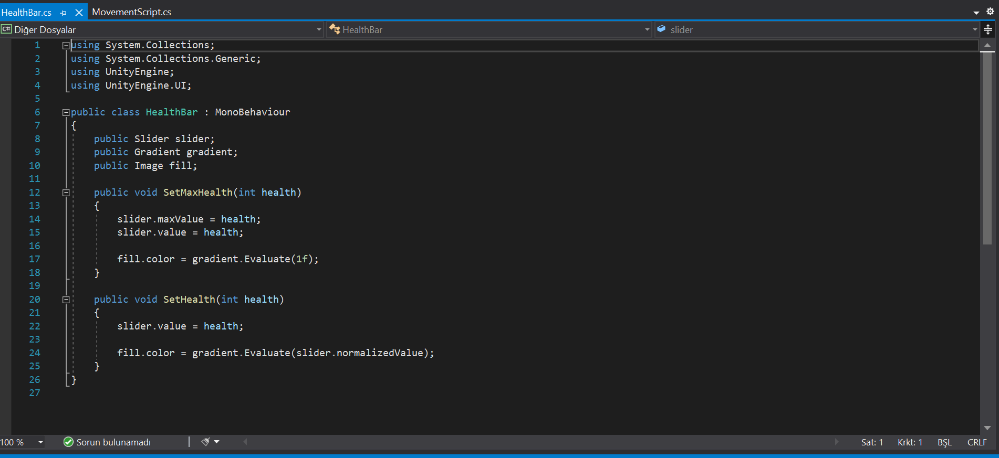
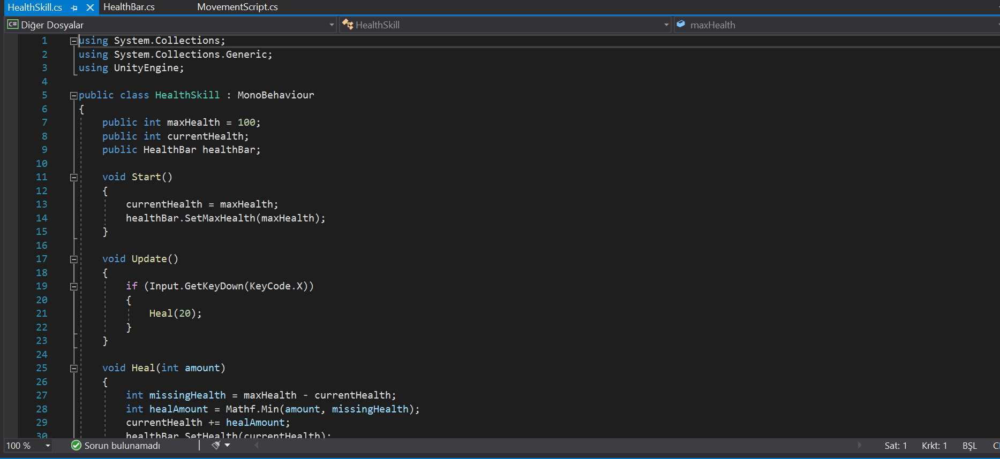
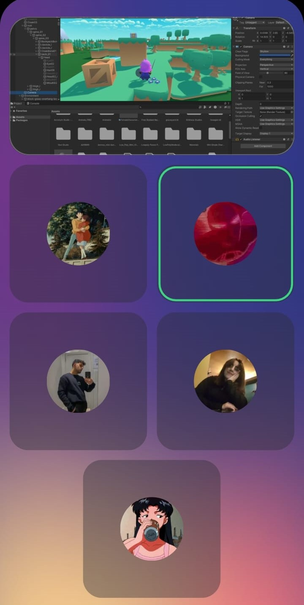
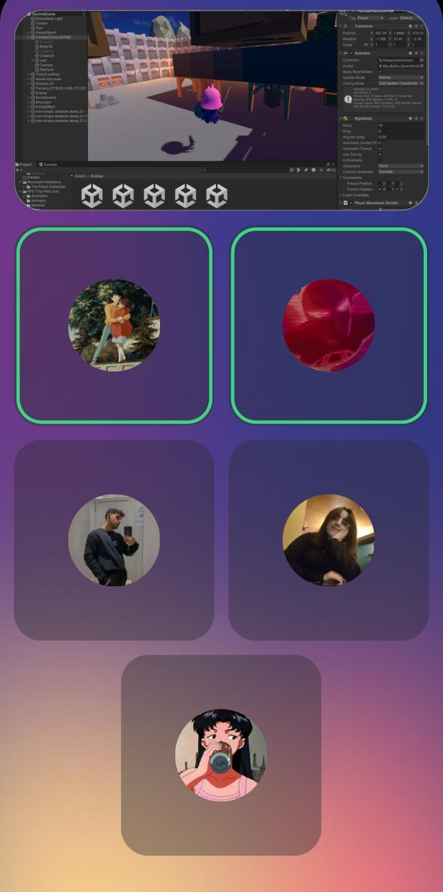
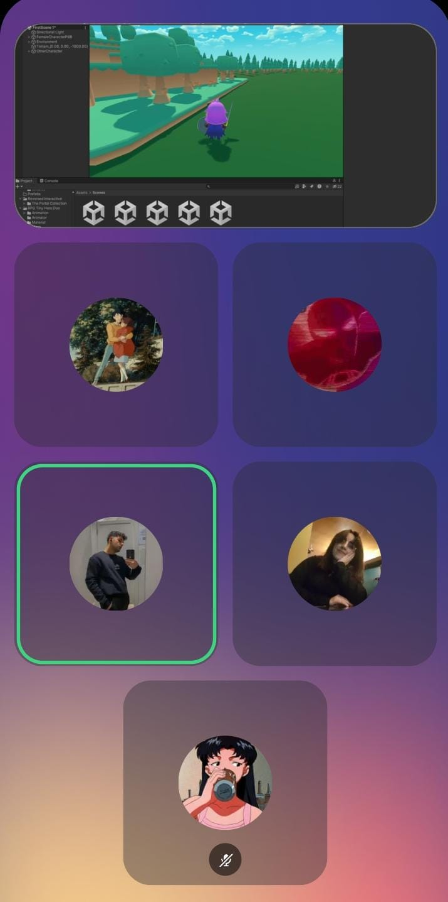
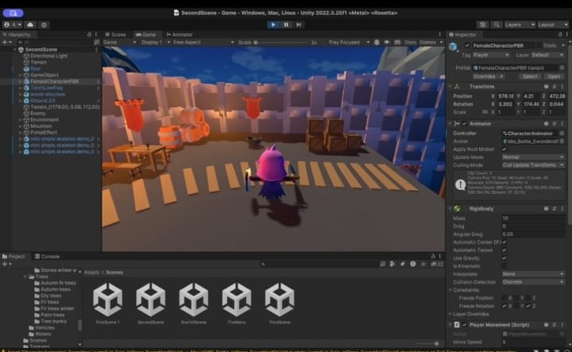
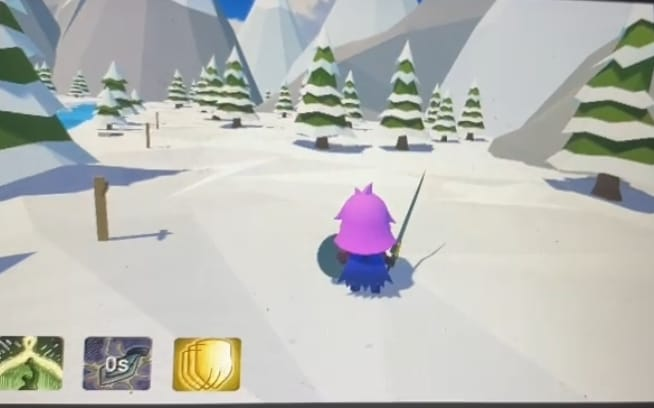
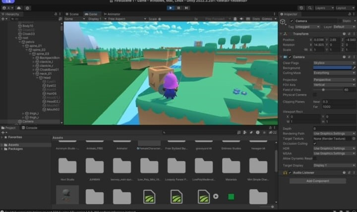

</head>
<body>

    <h1>TEAM NAME:</h1>
    
EPIC MIND

    

    <h2>TEAM MEMBERS</h2>
    <ul>
        <li><a href="https://www.linkedin.com/in/yagizsahinler/">Yağız Şahinler: Product Owner/Developer</a></li>
        <li><a href="https://www.linkedin.com/in/zozanakdogan/">Zozan Akdoğan: Scrum Master</a></li>
        <li><a href="https://www.linkedin.com/in/zumralkan/">Zümra Betül Alkan: Team Member/Developer</a></li>
        <li><a href="https://www.linkedin.com/in/zeynepsudeduman/">Zeynep Sude Duman: Team Member/Developer</a></li>
        <li><a href="https://www.linkedin.com/in/yasin-beken-51aa0427b/">Yasin Beken: Team Member/Developer</a></li>
    </ul>

    <h1>GAME LOGO:</h1>
    
GAME NAME: GUARDIANS OF SOUL

    

    <h2>PRODUCT BACKLOGS:</h2>
    
<a href="https://trello.com/invite/b/xrTqoIbq/ATTI4f8740de48680f66f6c977fad6bb6cdd8AB256ED/epic-minds">EPIC MIND'S TRELLO</a>

<h1>Guardian of Souls</h1>

<h2>Game Features</h2>
<ul>
    <li><strong>Story-Driven Gameplay:</strong>
        <ul>
            <li><strong>Main Character:</strong> A female warrior with amnesia embarks on a challenging journey to regain lost memories and discover her destiny.</li>
            <li><strong>Environments:</strong> The game features diverse and captivating settings, including forests, pine woods, and glacial realms.</li>
        </ul>
    </li>
    <li><strong>Emotional Journey:</strong>
        <ul>
            <li><strong>Emotion Discovery:</strong> The character explores emotions such as compassion, anger, and patience. These emotions unlock new abilities and enhance combat skills.</li>
        </ul>
    </li>
    <li><strong>Special Abilities:</strong>
        <ul>
            <li><strong>Healing Power:</strong> Gained through discovering compassion; this ability allows the character to heal herself and her allies.</li>
            <li><strong>Rage Power:</strong> Increases attack power through anger. Activated by pressing the Z key, lasts for 3 seconds, with a 10-second cooldown.</li>
            <li><strong>Shield Power:</strong> Acquired through patience; protects the character and her allies. Activated by pressing the C key, lasts for 3 seconds, with a 10-second cooldown.</li>
        </ul>
    </li>
    <li><strong>Diverse Enemies:</strong>
        <ul>
            <li><strong>Skeletons:</strong> The primary enemies encountered throughout the game.</li>
            <li><strong>Golem:</strong> A powerful enemy encountered in the final stage of the game.</li>
        </ul>
    </li>
    <li><strong>Magical Obelisk:</strong> A mystical obelisk emitting purple lights that assists the character in regaining memories and confronting past secrets.</li>
    <li><strong>Rescue and Protection:</strong> The character rescues and protects villagers from various dangers, leading to the acquisition of new abilities.</li>
    <li><strong>Dynamic and Emotional Storytelling:</strong> The game offers deep narrative and character development, engaging players emotionally as they explore the character’s world.</li>
    <li><strong>Impressive Graphics and Environments:</strong> A richly detailed game world with various biomes and atmospheric elements.</li>
    <li><strong>Inclusive Sound and Music:</strong> Emotionally charged music and sound effects that enhance the game's atmosphere and immerse players.</li>
</ul>

<h2>Game Overview</h2>

Forgotten memories, lost emotions, and an epic adventure... <strong>Guardian of Souls</strong> follows the journey of a female warrior with amnesia as she sets out to uncover her past and destiny. The game invites players into a deep narrative and emotional exploration.

As the character travels through diverse environments from forests to glaciers, she rediscovers forgotten emotions such as compassion, anger, and patience. These emotions grant her special abilities, enhancing her combat skills and protective powers. A mystical obelisk with purple lights helps her recover memories and confront the dark secrets of her past.

Facing skeletons and a powerful golem, the character uncovers her true strength to protect her people. <strong>Guardian of Souls</strong> offers an unforgettable experience, immersing players in a rich story and emotional depth at every step and challenge.

<h2>Summary</h2>

<strong>Guardian of Souls</strong> is a 3D platformer and puzzle game shaped by the power of emotions. Players embark on a journey with a female warrior to regain lost memories. The game features abilities that change based on the character's emotions and offers rich content. With emotionally and mentally challenging levels, it invites players to a deep exploration through stunning graphics and a captivating atmosphere.

    <h2>TARGET GROUP:</h2>
    
+8 years and above

    
Action, Adventure, and puzzle lovers.

    
    
    
    

  # [Epic Minds Assets](https://docs.google.com/document/d/1bZnlj9hFnKjZjAcyhmGC9UBHXMo2jX3bsds5yp9DO3E/edit?usp=sharing)

<h1>Sprint 1</h1>

<h2>Sprint Scoring</h2>

We evaluated the first sprint and scored it 7 points. The sprint was completed with 7 points as every topic discussed was addressed.

<h2>Daily Meetings</h2>

We aim to maintain continuous communication and ensure everyone has equal information about the product.

<strong>Time:</strong> Every day between 9-10 am

<strong>Place:</strong> Discord Voice Channel - WhatsApp

    
    
    

<h2>Development Process</h2>

Each team member participates in every step of product development, so there was no need to separate into sub-teams.

<ul>
    <li><strong>Character Game Name and Team Names Determination:</strong> We adopted a democratic process with voting.</li>
</ul>

    
    
    
    

<ul>
    <li><strong>Problems and Obstacles:</strong> Initial low motivation and stressful factors led to communication and indecision issues. Addressing expectations and sensitivities improved team trust and support.</li>
</ul>

<h3>Notes and Additional Information</h3>
<ul>
    <li>All tasks and progress will be tracked on <a href="https://trello.com/invite/b/xrTqoIbq/ATTI4f8740de48680f66f6c977fad6bb6cdd8AB256ED/epic-minds">Trello</a>.</li>
    <li>The Scrum Master is responsible for updating daily meetings.</li>
</ul>

<h1>Sprint 2</h1>

<h2>Estimated Points for Completion</h2>

8 Points

<h2>Sprint 2 Board Update</h2>

    

<h2>Product Status</h2>

    
    
    
    

<h2>Sprint Review</h2>

At the end of Sprint 2, the team gathered to review the sprint. We decided to change the game character in this sprint.

<strong>Sprint Review Participants:</strong> Yağız, Yasin, Zeynep, Zümra, and Zozan.

<h2>Sprint Retrospective</h2>

The score for Sprint 2 is a full 8 points. It was emphasized that team members need to be more active in future sprints. Assignments were made until the next sprint.

<ul>
    <li><strong>Assignments:</strong>
        <ul>
            <li>Portal, animation, start, AI, sound (Yasin)</li>
            <li>Key collection, box movement, health bar (Yağız)</li>
            <li>Completion of Level 1 was decided.</li>
        </ul>
    </li>
</ul>

<h2>Notes on the Team Between Sprint 1 and Sprint 2</h2>

<h3>Good Points:</h3>
<ul>
    <li>Team dynamics improved after minor disputes.</li>
    <li>The team became more active and took initiatives.</li>
</ul>

<h3>Bad Points:</h3>
<ul>
    <li>There is a tendency to leave some tasks to the last minute even if interim goals are completed.</li>
</ul>

<h1>SPRINT 3</h1>

<h2>Estimated Points for Completion:</h2>

9 Points

The point logic includes: health and rage skills, animations, transitions, sounds, Cinemachine, remaining code, overall evaluation, team communication, and activity.

<h2>Sprint 3 Board Update:</h2>

    

<h2>Daily Scrum</h2>

Daily Scrum meetings were conducted on Discord between 9-10 am or via WhatsApp if a suitable time was not found.

    
    
    

<h2>Product Status</h2>

    
    
    

<h2>Final Video:</h2>

[Video Link Here]

<h1>SPRINT REVIEW</h1>

We should congratulate ourselves for the dedication and effort put in by the team of 5 throughout the process. During this period, we completed:

<ul>
    <li>1 character design</li>
    <li>3 different scenes</li>
    <li>Numerous mechanical codes</li>
    <li>3D assets</li>
    <li>Camera integration</li>
    <li>NPCs</li>
    <li>Enemies</li>
    <li>UI designs</li>
    <li>AI additions</li>
</ul>

24 Backlog points were completed.

<h2>Sprint Review Participants:</h2>
<ul>
    <li>Yağız</li>
    <li>Yasin</li>
    <li>Zeynep</li>
    <li>Zozan</li>
    <li>Zümra</li>
</ul>

<h2>Sprint Retrospective</h2>

We discussed completing the project after the academic period.

</body>
</html>
